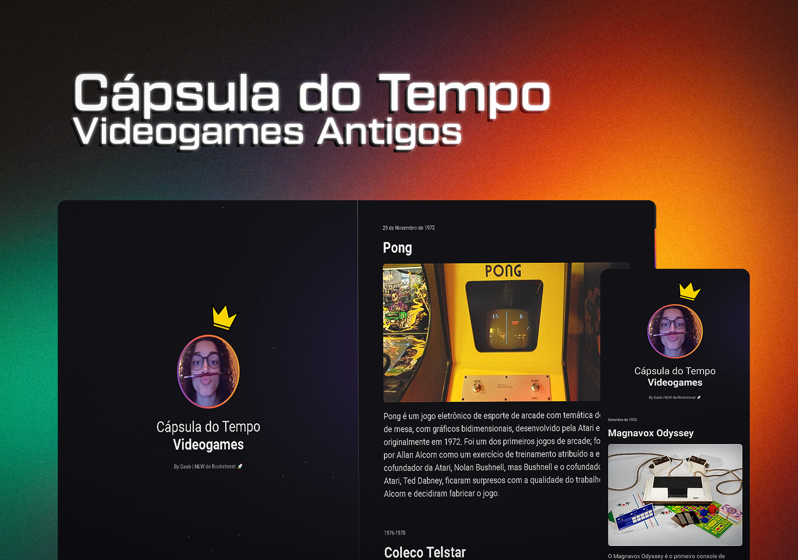

<h1 align="center">Cápsula do Tempo - Videogames Antigos</h1>

  <a href="#-tecnologias">Tecnologias</a>&nbsp;&nbsp;&nbsp;|&nbsp;&nbsp;&nbsp;
  <a href="#-projeto">Projeto</a>&nbsp;&nbsp;&nbsp;|&nbsp;&nbsp;&nbsp;
  <a href="#-funcionalidades">Funcionalidades</a>&nbsp;&nbsp;&nbsp;&nbsp;&nbsp;&nbsp;

 

  

### 💻 Projeto
 Esse é um projeto Web Responsivo de uma cápsula do tempo para exibir memórias em uma linha do tempo.
- [Acesse o projeto finalizado, online](https://devgaab.github.io/capsula-do-tempo-videogames/)

### 🚀 Tecnologias
 Esse projeto foi desenvolvido durante o NLW da Rocketseat com as seguintes tecnologias:

- HTML
- CSS
- Git e Github

### ⚙ Funcionalidades

- Projeto responsivo
- Scrollbar personalisado

---